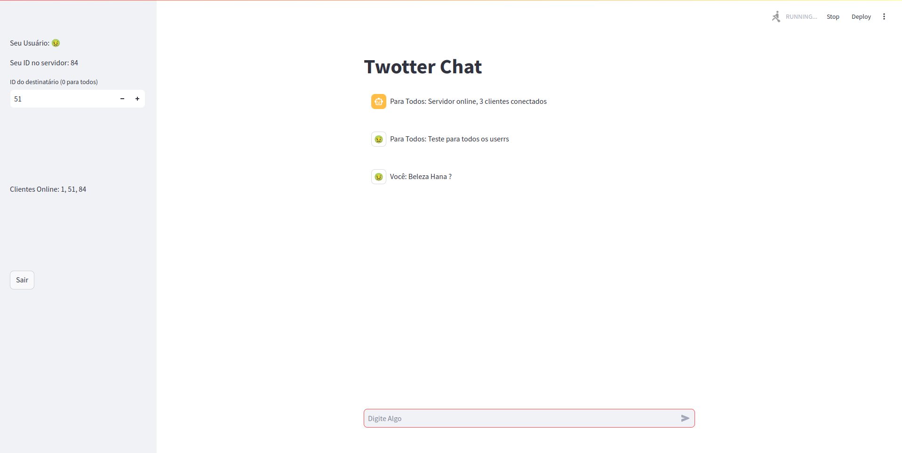

# Twotter

## Instalação

Para instalar as dependências do projeto, bastar rodar os comandos abaixo:

```bash
pip install poetry
git clone https://github.com/edu010101/Twotter.git
cd Twotter
poetry install
```

## Execução

### Servidor

Para rodar o servidor, basta rodar o comando abaixo:

```bash
poetry run python start_server.py
```

### Cliente

Para rodar o cliente, basta rodar o comando abaixo:

```bash
poetry run streamlit run start_client.py
```

## Utilização

### Servidor

O servidor em geral não necessita de interação com o usuário, todavia é importante ressaltar que ao ser inicializado, o mesmo irá criar um arquivo de log chamado `server.log` na raiz do projeto. Caso deseje visualizar o log, basta abrir o arquivo com um editor de texto.

### Cliente

Inicialmente a UI pedirá para que o usuário insira o endereço do servidor na rede. Caso o servidor esteja rodando na mesma máquina, basta manter o endereço padrão `0.0.0.0`.

Após inserir o endereço do servidor, o usuário deverá escolher seu ID e nome de usuário. O ID é um número inteiro que deve ser único para cada usuário. Caso o ID já esteja em uso, o servidor irá retornar um erro e o usuário deverá escolher outro ID. O nome de usuário é um emoji que pode ser selecionado na lista de emojis disponíveis.

<div style="test-align: center;">
    
</div>


Após inserir o ID e nome de usuário, o usuário será redirecionado para a página principal do Twotter. Nesta página, o usuário poderá visualizar os tweets de todos os usuários, bem como enviar um novo tweet.

Na lateral esquerda o usuário poderá visualizar seu ID e nome de usuário. 
Logo abaixo o usuário poderá escolher para qual usuário deseja enviar um tweet, selecionando seu ID. Para enviar uma mensagens para todos os usuários, basta selecionar o ID `0`.
Por fim, existe um botão de logout que permite o usuário se desconectar do servidor.

<div style="test-align: center;">
    
</div>


## Autores

|  [<br><sub>Eduardo Lopes</sub>](https://github.com/edu010101) |  [<br><sub>Alberto Higuti</sub>](https://github.com/albertohiguti) 
| :---: | :---: |